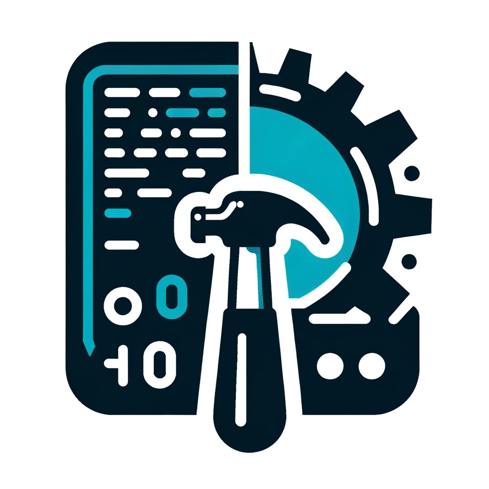

# CmdCraft CLI



CommandCraft is a versatile command-line interface (CLI) framework tool designed to handle a variety of commands and subcommands, providing a flexible and user-friendly experience.

## Features

- Support for multiple command types including string, integer, boolean, float, duration, and function flags.
- Subcommand support for complex command structures.
- Easy-to-use flag handling for enhanced command line options.

## Installation

To install CommandCraft, clone the repository and build the project:

```bash
git clone git@github.com:lkendrickd/cmdcraft.git
cd commandcraft
go build
```

### Example usage in cmd/main.go

The example commands are included in cmd/main.go

**echo** - echos a message back  
**date** - prints today's date

With this in mind setup any flags if needed for your function.  Next, define your function and place it into a command.
This will enable the function to be used in the cli framework.

### Build the Binary

```
make build
```
